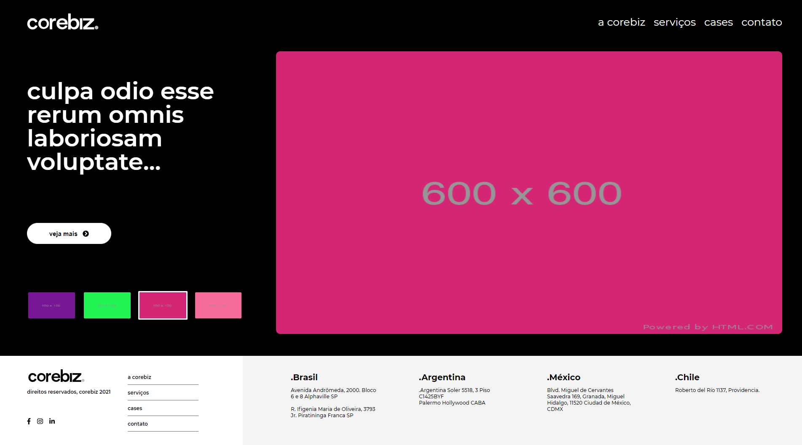
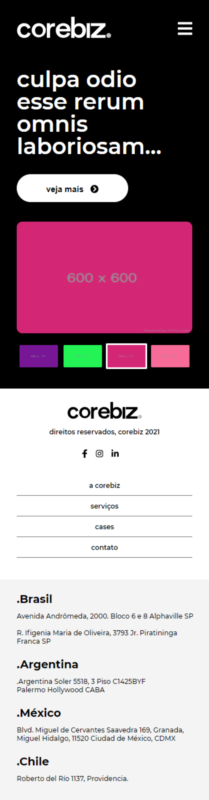
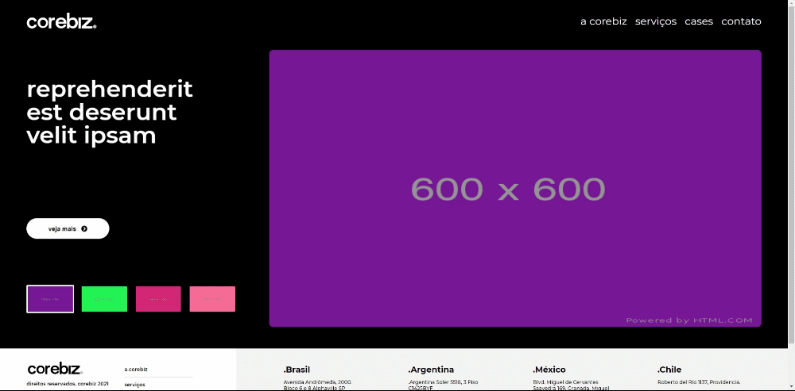

# A proposta 

Esta aplicação foi feita para o evento GoBeyond da Corebiz.\
A prosta era criar uma aplicação o mais próxima possível com o layout oferecido pela Corebiz. 

## O projeto
[Ir para o site](https://gobeyondfinalapp.vercel.app/)
<h1 align="center">
    
</h1>

<h1 align="center">
    
</h1>

Foi utilizado pré-render, com isso, caso a pessoa esteja com uma conexão lenta,
ela terá um feedBack de que algo esta carregando na tela, ao invés de visualizar espaços vazios no site. 
<h1 align="center">
    
</h1>
##Tecnologias

Este projeto foi desenvolvido utilizando as seguintes tecnologias:
- [React](https://reactjs.org)
- [Axios](https://github.com/axios/axios)
- [React Query](https://react-query.tanstack.com/)
- [Sass](https://sass-lang.com/) ( Node-Sass )

##Iniciando o projeto

Para iniciar o código é necessário primeiro clonar o repositório

### `git clone https://github.com/RonyNogueira/gobeyondfinalapp.git`
Logo após é necessário instalar as dependencias do projeto\
###`npm install`\
Em seguida rode o seguinte comando para iniciar a aplicação localmente\ 
### `npm start`

IMPORTANTE ! ! ! essa aplicação utiliza "Node-Sass 6.0.1" tenha certeza de que a versão do Node.js instalada em seu computador seja pelo menos a 16.0

